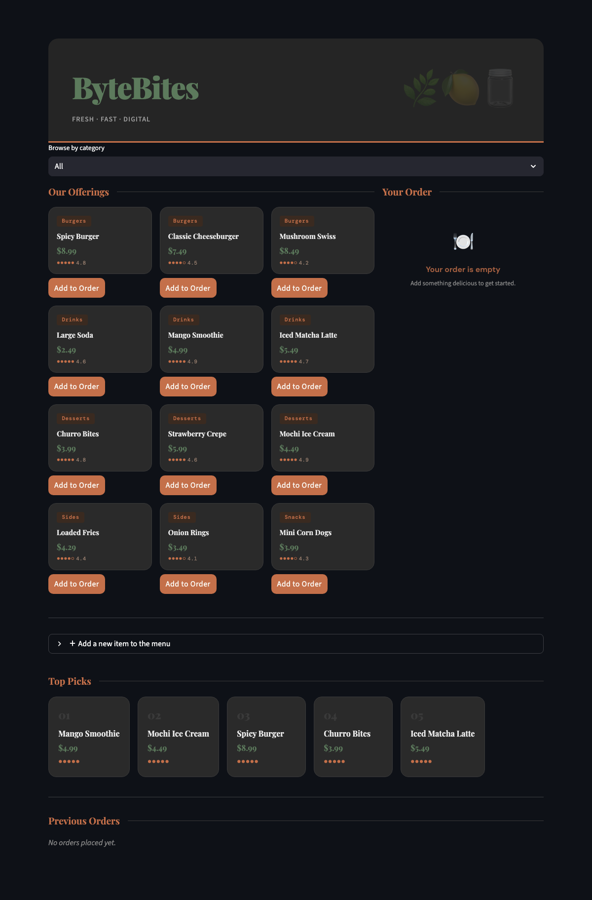

# ByteBites

A food ordering app built with Streamlit and Python.

---

## Screenshots

### Landing


### Adding New Items


### Order Total


### Order Placed

---

## Features

- Browse menu items by category
- Add items to order directly from the menu
- Real-time order total with subtotal breakdown
- Add custom items to the menu
- Top 5 picks ranked by popularity
- Order history with timestamps

---

## Stack

- **Python** — backend logic (`models.py`)
- **Streamlit** — UI
- **Decimal** — precise price calculations

---

## Run Locally

```bash
streamlit run app.py
```
