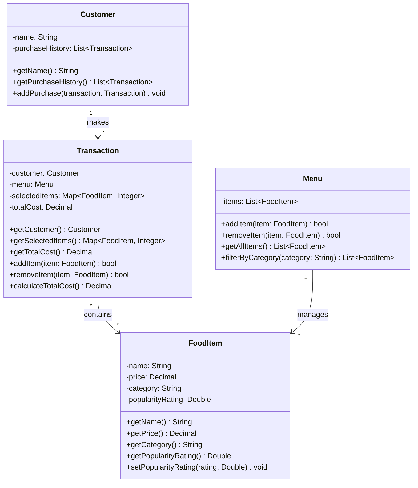

# ByteBites Backend System UML Class Diagram

```mermaid
classDiagram
    class Customer {
        -name: String
        -purchaseHistory: List~Transaction~
        +getName() String
        +getPurchaseHistory() List~Transaction~
        +addPurchase(transaction: Transaction) void
    }

    class FoodItem {
        -name: String
        -price: Decimal
        -category: String
        -popularityRating: Double
        +getName() String
        +getPrice() Decimal
        +getCategory() String
        +getPopularityRating() Double
        +setPopularityRating(rating: Double) void
    }

    class Menu {
        -items: List~FoodItem~
        +addItem(item: FoodItem) bool
        +removeItem(item: FoodItem) bool
        +getAllItems() List~FoodItem~
        +filterByCategory(category: String) List~FoodItem~
    }

    class Transaction {
        -customer: Customer
        -menu: Menu
        -selectedItems: Map~FoodItem, Integer~
        -totalCost: Decimal
        +getCustomer() Customer
        +getSelectedItems() Map~FoodItem, Integer~
        +getTotalCost() Decimal
        +addItem(item: FoodItem) bool
        +removeItem(item: FoodItem) bool
        +calculateTotalCost() Decimal
    }

    Customer "1" --> "*" Transaction : makes
    Transaction "*" --> "*" FoodItem : contains
    Menu "1" --> "*" FoodItem : manages
```
