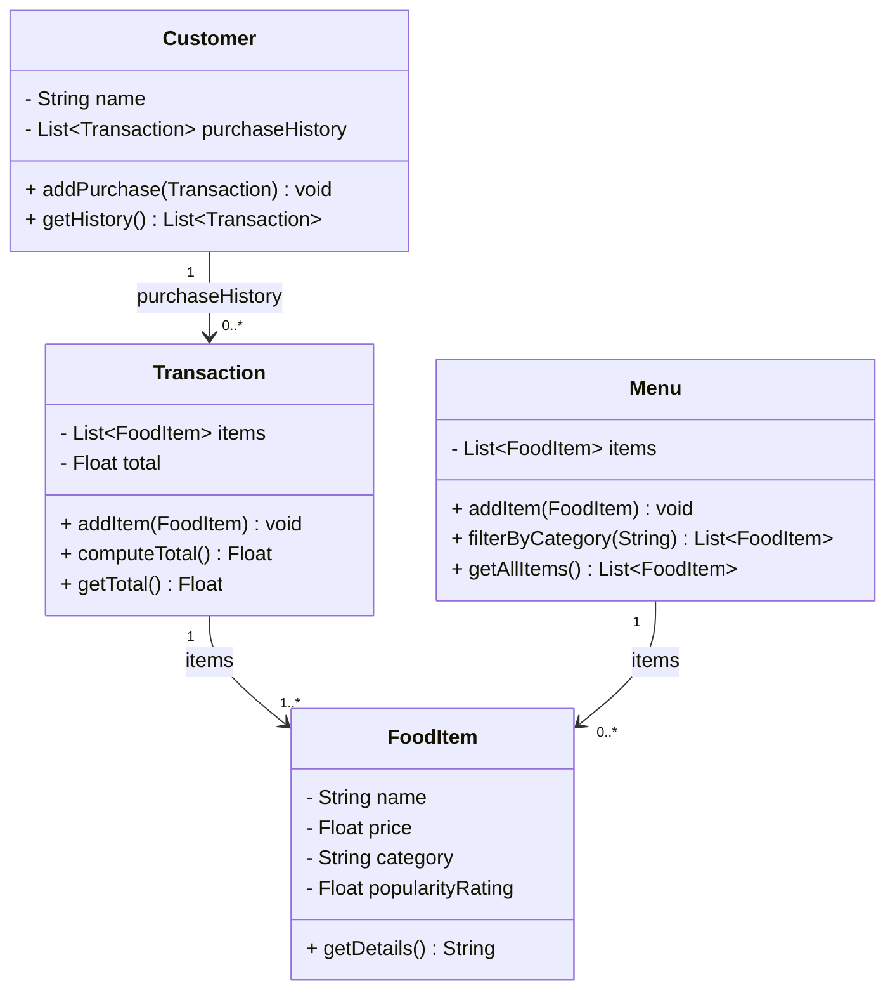

# ByteBites UML Class Diagram

```mermaid
classDiagram
    class Customer {
        - String name
        - List~Transaction~ purchaseHistory
        + addPurchase(Transaction) void
        + getHistory() List~Transaction~
    }

    class FoodItem {
        - String name
        - Float price
        - String category
        - Float popularityRating
        + getDetails() String
    }

    class Menu {
        - List~FoodItem~ items
        + addItem(FoodItem) void
        + filterByCategory(String) List~FoodItem~
        + getAllItems() List~FoodItem~
    }

    class Transaction {
        - List~FoodItem~ items
        - Float total
        + addItem(FoodItem) void
        + computeTotal() Float
        + getTotal() Float
    }

    Customer "1" --> "0..*" Transaction : purchaseHistory
    Transaction "1" --> "1..*" FoodItem : items
    Menu "1" --> "0..*" FoodItem : items
```